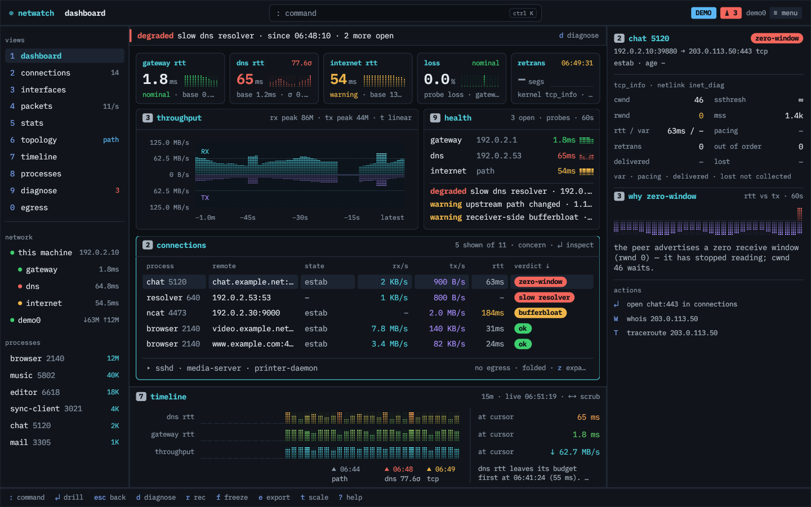
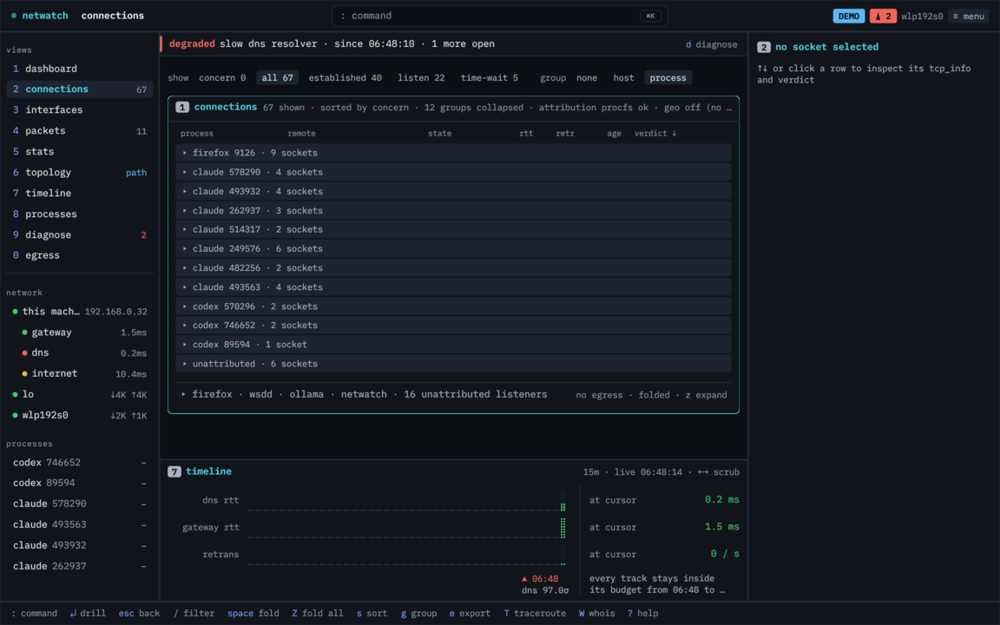
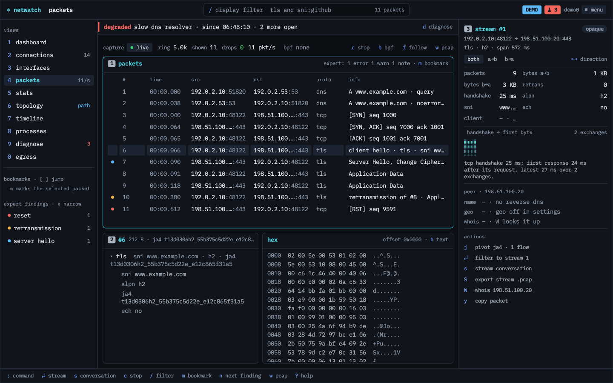
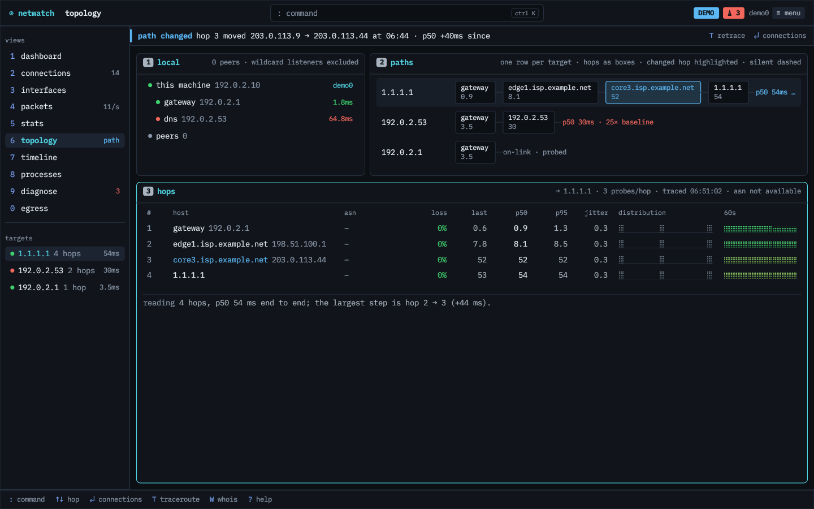
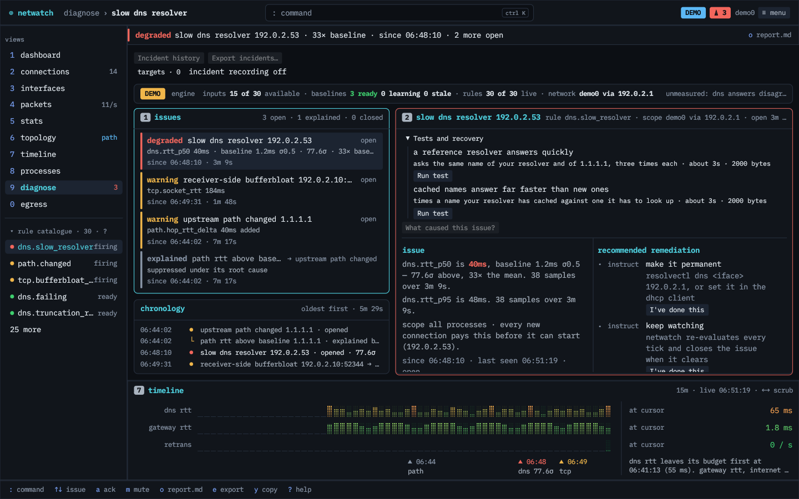
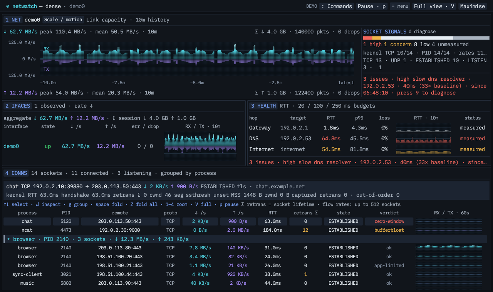
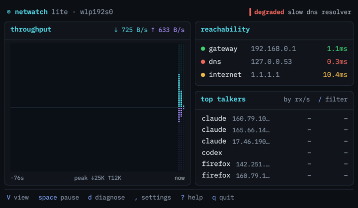
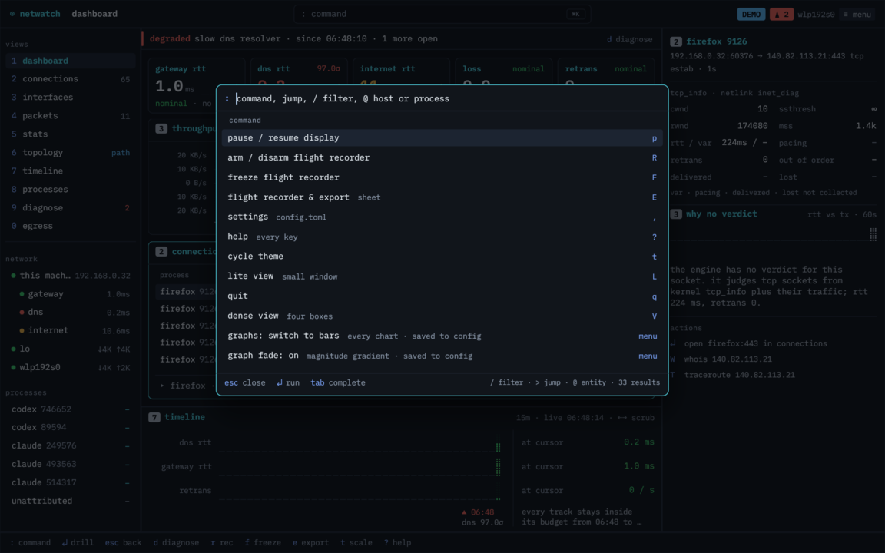

# netwatch desktop

A native desktop app for [netwatch](https://github.com/matthart1983/netwatch). It runs the same collectors, diagnose engine and egress linter as the terminal tool, in a window, with a mouse, a command palette and room to show more than 80 columns can hold.



It is not a remote dashboard. There is no server and no second engine. The app links the `netwatch` crate, starts its runtime on a background thread, and draws what that runtime sees on this machine.

## Contents

- [What you get](#what-you-get)
- [Building](#building)
- [Running](#running)
- [Permissions](#permissions)
- [The window](#the-window)
- [Keys](#keys)
- [The ten tabs](#the-ten-tabs)
- [Views: full, lite, dense](#views-full-lite-dense)
- [Sheets](#sheets)
- [Themes and graphs](#themes-and-graphs)
- [Settings and saved state](#settings-and-saved-state)
- [How it is built](#how-it-is-built)
- [Development](#development)
- [Known gaps](#known-gaps)
- [License](#license)

## What you get

- Ten tabs: dashboard, connections, interfaces, packets, stats, topology, timeline, processes, diagnose and egress.
- Every socket with its owning process and the diagnose engine's verdict (bufferbloat, zero-window, retrans-burst and so on), grouped by process or host, with kernel `tcp_info` in a side inspector.
- A packet list with a display filter, layered decode, hex, and a stream inspector. Export any filtered view to pcap.
- Diagnose laid out as issue, probable cause, remediation and the condition that closes it, with a chronology of what happened in what order.
- Egress policy: learned destinations per process, drift, and the TOML diff before anything is written.
- A flight recorder you can arm, freeze and export as an incident bundle.
- Three views of the same running backend. Full is the workbench, lite is a small always-on-top window, dense is four boxes packed with numbers.
- Eight themes, a btop-style dot graph look (or solid bars), and a command palette that prints the key for everything it runs.

## Building

The netwatch library comes from crates.io as `netwatch-tui`, pinned to an exact version (0.35.1). You don't need a netwatch checkout.

```sh
git clone https://github.com/matthart1983/netwatch-desktop
cd netwatch-desktop
cargo build --release --locked
```

You need a recent stable Rust toolchain and the same system libraries netwatch needs, plus what eframe needs to open a window.

On Fedora:

```sh
sudo dnf install libpcap-devel libxkbcommon-devel wayland-devel mesa-libGL-devel
```

On Debian or Ubuntu:

```sh
sudo apt install libpcap-dev libxkbcommon-dev libwayland-dev libgl1-mesa-dev
```

On macOS, the Xcode command line tools are enough.

This build turns off netwatch's eBPF attribution (`default-features = false`), so there is no kernel-capability dependency beyond packet capture.

To build against a local netwatch checkout instead, override the dependency for one command rather than editing `Cargo.toml`:

```sh
cargo build --config 'patch.crates-io.netwatch-tui.path="../netwatch"'
```

The checkout's version has to match the pin, or cargo warns that the patch was not used and builds the crates.io release. The override also rewrites `Cargo.lock`, so leave that change out of commits (`git checkout Cargo.lock`).

## Running

```sh
./target/release/netwatch-desktop
```

Useful flags:

| flag | what it does |
|---|---|
| `--demo` | Runs the real runtime with the diagnose demo scenario and a seeded packet capture. Good for seeing every screen populated. |
| `--tab <name>` | Opens on a tab: `dashboard`, `connections`, `interfaces`, `packets`, `stats`, `topology`, `timeline`, `processes`, `diagnose`, `egress`. |
| `--view full\|lite\|dense` | Starts in a view. `--lite` is short for `--view lite`. |
| `--no-sandbox` / `--sandbox-strict` | Overrides config.toml's `sandbox` for this launch, as in the TUI. |
| `--zoom 1-4` | In dense view, opens with one box zoomed. |
| `--sheet <name>` | Opens a sheet: `settings`, `recorder`, `firstrun`, `palette`, `help`. |
| `--theme <name>` | Starts with a palette (see [themes](#themes-and-graphs)). |
| `--window-size WxH` | Sets the initial window size in logical pixels. |
| `--app-chrome` | Draws the app's own title bar and window controls instead of the system's. |
| `--graph-preview` | Runs on a synthetic snapshot with no collectors. Used for graph and layout checks. |
| `--check-runtime` | Starts the runtime headless, prints interface, capture, diagnose coverage, socket and PID counts and the capability report, then exits. |
| `--screenshot <path>` | Saves a PNG of the window after about three seconds and exits. Runs with this flag neither read nor write saved layout. |
| `--help` / `--version` | Usage or version. Unknown flags and bad values are rejected. |

If the runtime fails to start (for example `sandbox = "strict"` where the platform can't enforce it), the window says why and offers `r` to retry with the sandbox off for that launch, or `S` to set `sandbox = "on"` and retry.

`--check-runtime` is the quickest way to find out what the app can see on a machine:

```
interface: wlp192s0
counters only · Capture failed: libpcap error: ... CAP_NET_RAW may be required
no visible findings · 12/25 rule inputs available · 0 learning · 13 unavailable
107 connections · 78 with a pid · 61 kernel TCP records
```

## Permissions

Without packet capture the app still works. You get interface counters, the socket table with process attribution for processes your user can inspect, kernel TCP metrics, and active probes. Per-flow rates, the packet list, TLS and DNS decode, and handshake timing need capture.

On Linux, give the binary the raw-socket capability once. It attaches to the file, so run it again after every rebuild:

```sh
sudo setcap cap_net_raw+eip ./target/release/netwatch-desktop
```

The first-run sheet shows what is ready, what needs a grant, and the exact command for the running executable. It opens on first launch and again if a capability that was ready goes missing. Press `↵` to continue without capture.

netwatch confines its collector workers with Landlock. Socket ownership is read by a small thread that starts before confinement and only reads kernel `/proc` tables, so attribution works with the sandbox on. Sockets owned by other users' processes (root daemons) stay unattributed unless you run with more privilege.

Active health checks send DNS, reachability and STUN probes. Collection and analysis stay on the machine. Online GeoIP lookups and AI insights are off by default and say what they send before they send it.

## The window



Every tab shares one frame:

- The title bar has the breadcrumb (for example `connections › claude:443`), a command field that opens the palette, chips for recorder state, pause, open issues, blocked egress destinations and egress drift, the capture interface, and the menu.
- The navigator on the left lists the ten tabs with live badges (socket count, packet rate, open issue count, blocked or drifting destinations). Under it is a network tree (this machine, gateway, dns, internet, interfaces) and the top processes. Clicking a node filters the current tab and adds it to the breadcrumb. `esc` removes it.
- A status strip appears when an issue is open. It reads from the same issue list as the diagnose tab and disappears when things are healthy.
- The inspector on the right follows the selection on tabs that have one (dashboard, connections, packets, processes, egress).
- The timeline dock sits under the dashboard, connections and diagnose.
- The footer lists the keys the current tab responds to. Every hint is clickable and does the same thing as the key. Results of writes (exports, policy changes, config saves) show at the right with their path.

Below 1180 points wide the navigator shrinks to a rail of digits; below 1000 the inspector moves into a sheet opened with `I`. Points are window pixels divided by the text size, so at the default 115% that's about 1357 and 1150 pixels; `ctrl -` brings the navigator back on a smaller screen. The menu and palette can also collapse the navigator and hide the timeline dock, and the dock gives up height in short windows.

## Keys

Global keys work on every tab unless a sheet is open.

| key | action |
|---|---|
| `1`-`9`, `0` | switch tab |
| `:` or `ctrl-k` | command palette |
| `↵` / `esc` | drill into the selection / back one breadcrumb level |
| `↑` `↓` | move the selection |
| `tab` | move focus between panels |
| `p` | pause or resume the display (collectors and recording keep running). `space` is for panel actions such as folding |
| `d` | diagnose |
| `ctrl-c` | copy the selected row |
| `I` | inspector sheet, when the window is too narrow for the column |
| right-click | a row's actions, the same as its inspector |
| `R` | arm or disarm the flight recorder |
| `F` | freeze the recorder |
| `E` | open the recorder and export sheet |
| `V` | cycle full, lite, dense |
| `L` | lite view |
| `t` | graph scale or window on graph tabs |
| `,` | settings |
| `?` | every key for the current tab, or for dense and lite in those views |
| `q` | quit |
| `ctrl +` / `ctrl -` / `ctrl 0` | larger or smaller text, or back to 115% (shared across all views). `ctrl` + scroll and trackpad pinch also work |

### Text size

Text size scales the whole interface, from 100% to 300%, and is shared by all three views. Change it from the `☰` menu (`−`, `+`, `reset` and a list of sizes), the command palette (type "text size"), the "this app" group in settings, lite's own `☰`, the picker at the top of the first-run sheet, or the keys above. Every change applies at once, says the new size, and is saved in `desktop.toml`.

## The ten tabs

Each tab lists its own keys in the footer and in `?`.

**1 dashboard.** Five stat cards (gateway, dns and internet rtt, probe loss, retransmits) with sparklines and baselines, the throughput graph, health rows with the engine's findings, the top connections by concern, and the timeline dock. `↵` opens the selected socket in connections, `e` exports the diagnose report, `t` switches linear or log scale.

**2 connections.** Every socket with process and PID, remote host (resolved when known), application protocol, state, rates, kernel rtt, retransmits, age, verdict and a 60 second rtt history. Control strip for show (concern, all, established, listen, time-wait) and group (none, host, process). Listeners and system daemons with no egress fold into one line (`z`). With grouping on, `space` folds the group under the cursor, `←` `→` fold and unfold, `Z` folds all, and `↑` `↓` also stop on group headers. `/` filters, `s` sorts, `g` groups, `↵` opens packets for the socket, `p` its process, `W` whois, `T` traceroute, `e` exports JSON and CSV.

**3 interfaces.** A table sized to the interface count with role, link speed, rates, a saturation meter, errors, drops and history. The detail panel has addresses, MTU, session counters and a one-line finding. `i` moves capture to the selected interface.



**4 packets.** The capture strip (live or stopped, ring size, shown, drops, packets per second, BPF filter) and a virtualized list with an expert gutter. The title-bar field becomes the display filter with a live match count, using netwatch's filter grammar (`tcp`, `dns`, `10.0.0.1`, `port 443`, `stream 7`, `sni:github`, `decrypted:true`, `and`, `or`, `not`). Under the list is a layered decode (frame, ethernet, ip, tcp or udp, tls or quic, l7) beside hex that highlights the selected layer's bytes. The inspector summarises the stream: 5-tuple, TLS version and ALPN, bytes each way, retransmits, handshake timing. The inspector adds the peer's reverse DNS, geo and (after `W`) whois, and names the JA4 client. Keys: `c` capture, `b` BPF, `f` follow (wheel scrolling turns it off), `/` filter and `esc` to clear it, `↵` filters to the stream and then opens its connection, `m` bookmark, `[` / `]` previous or next bookmark, `M` bookmarks only, `n` / `N` next finding, `x` findings only, `h` hex or text, `w` pcap of the list, `S` pcap of the stream, `j` pivot on JA4, `W` whois, `y` copy the packet, `i` interface. Right-click a row for the same actions. Bookmarks last for the session.

**5 stats.** Counters for packets, bytes, flows and protocol shares; a protocol breakdown with l7 nested under l4; top processes and remotes; session throughput; and an rtt distribution on a log axis with p50, p90 and p99. `[` `]` window, `u` bytes or frames.



**6 topology.** This machine, gateway, DNS servers and on-link peers; each target's path drawn as chained hop boxes (changed hops highlighted, silent hops dashed); and a hop table with loss, last, p50, p95, jitter and distribution. A hop that doesn't answer while later hops do reads as a silent hop, not loss. `T` traces the target or selected hop, `W` whois, `↵` connections for that host.

**7 timeline.** DNS, gateway and internet rtt, retransmits and throughput on one time axis with a shared cursor, event markers, an events table, and every track's value at the cursor with a plain statement of what moved first. `←` `→` scrub, `t` window (1m to 1h), `k` kinds, `esc` back to live.

**8 processes.** Per-process connections, rates, rtt p50, retransmits and worst verdict. The inspector reads command line, cgroup, user, threads and file descriptors from `/proc`, lists destinations with their egress verdicts, and plots tx against rtt.



**9 diagnose.** An engine strip (inputs available, baselines ready or learning, rules live) so an empty issue list can be read correctly. Issues in severity order, the chronology, and a detail pane in report order: evidence, ranked probable causes with each check written out, remediation steps, and the condition that closes the issue. `↵` applies a fix where netwatch can (simulated in demo mode, never applied by a live desktop session), `a` acknowledges, `m` mutes for an hour, `o` writes `report.md`, `y` copies.

The target strip expands to show configured services and their DNS, TCP, TLS and HTTP probe results. In **Tests and recovery**, each offered test describes its traffic and estimated cost before you run it; running tests and the latest results appear alongside it. **I've done this** records a manual remediation step and lets the engine check recovery, including re-running supporting tests after a minute. **What caused this issue?** saves your answer with the recorded incident when episode recording is enabled.

**0 egress.** Learned destinations per process as a foldable tree with match type (SNI, IP, ASN, ECH), bytes, first and last seen, activity and policy verdict. The inspector shows what was seen and which rule line would admit it. `a` reviews allowing one destination, `d` keeps warning for the re-warn interval, `↵` on a destination opens packets, and `↵` on a process or `w` reviews its promotion. `P` reviews all observed processes together; `x` reviews removing the selected process rule. Every policy change shows the complete file diff before `y` or **Write policy** confirms it; `esc` cancels. Allowing an unruled process explains how many other observed destinations will become drift. A destination on the policy's block list, global `[block]` or `[process.<name>.block]`, reads `blocked` in red, comes first in the status strip and the tab badge, and has no allow action, because a block entry wins over any allow line. Promotion leaves blocked destinations out of the rule, and its review names them. The navigator lists the global block list and the alert mode: blocked destinations only by default, every finding with `alert = "all"`. Demo mode disables policy writes. Invalid or group/world-writable policy files are refused; the backend also rejects a file changed since preview. Writes preserve existing permission bits, comments, unrestricted ports, the global block list and the alert mode. Allowing and promoting also keep a rule's own block list. Removing a rule removes its block list with it, and the review names the entries that go.

## Views: full, lite, dense

All three views run on the same backend. Switching views never restarts collectors, and the selected socket, pause state and graph settings carry across.



**Dense** packs four boxes: mirrored throughput with session totals, interfaces, health with rtt budget meters, and connections with the selected socket's kernel state above the table. `1`-`4` zoom a box. Dense uses the same text sizes and interface zoom as full and lite. In the connections box `g` cycles grouping, `space` and `Z` fold groups. `ctrl +` / `ctrl -` adjusts the shared text size; switching views keeps text the same size. See [docs/DENSE.md](docs/DENSE.md).



**Lite** is a small window (minimum 720 by 420) with throughput, reachability and top talkers. It remembers its size and can stay on top ("lite window on top" in the menu or palette).

## Sheets

Sheets open over the current screen, which keeps updating underneath. `esc` closes any of them.



- **Command palette** (`:`). Fuzzy search over commands, tab jumps, packet display filters and entities (hosts and processes). Every row shows the key that does the same thing. `/` narrows to filters, `>` to jumps, `@` to hosts and processes. `tab` completes, `↵` runs. Recent commands come first.
- **Settings** (`,`). The netwatch `config.toml` grouped as appearance, refresh and capture, GeoIP, alerts, AI insights and security. `←` `→` cycle values, `↵` edits text, `S` saves. Invalid values are marked on the row. Below the settings is the live capability report.
- **Flight recorder** (`E`). Armed, frozen and exported states with who froze it, packet density over the five-minute ring, the files that go into the bundle, and where they land. `R` arms, `F` freezes, `E` exports.
- **First run.** What works now, what needs a grant, and the command for this platform.
- **Help** (`?`). Global keys and the current tab's keys.

## Themes and graphs

Themes: `dark` and `paper` from the design spec, plus the six netwatch TUI themes `terminal`, `ocean`, `solarized`, `dracula`, `nord` and `sky`, mapped slot for slot. Pick one from the menu or the palette ("cycle theme"). The settings sheet's theme, view and default-tab rows configure the terminal app.

Charts have two looks. The default is btop-style dot cells lit from the baseline. The other is solid bars. Either can use a magnitude fade that runs from dim at the baseline to the full series colour at the top. The switch applies to every chart in the app: throughput plots, sparklines, timeline tracks, histograms and share bars. Toggle it from the menu at the top right, the palette (`graphs: switch to bars`), or settings. It is saved as `graph_style` (`dots` or `bars`) and `graph_fade` in the netwatch config, so the TUI follows the same setting.

The UI uses IBM Plex Mono throughout and IBM Plex Sans for first-run prose, with Adwaita Mono as a fallback for symbols Plex lacks. All three are bundled.

## Settings and saved state

Two files:

- `~/.config/netwatch/config.toml` is netwatch's own config, shared with the TUI: theme, graph style, refresh rate, capture interface, BPF filter, GeoIP, alerts, AI insights, sandbox mode and so on. Edit it with the settings sheet.
- `~/.config/netwatch/desktop.toml` holds the desktop's layout: the last tab and view, theme, text size (`zoom`), dense grouping, dock height, the lite window size, per-tab choices (sort, grouping, filters) and recent palette commands. Set `NETWATCH_DESKTOP_PREFS` to use another path. It's written atomically. A value that doesn't fit, such as an unknown tab, falls back on its own; a file that isn't valid TOML is copied to `desktop.toml.bak` and the layout starts from defaults.

Exports go to `~/.cache/netwatch/exports/`. The egress policy lives at `~/.config/netwatch/egress-policy.toml`.

## How it is built

The app uses egui and eframe for the UI. It depends on netwatch as a library.

```
netwatch-desktop
├── backend.rs      runtime thread: App, tick, Snapshot, Command → ActionResult
├── shell.rs        the Screen and Sheet traits, keys, hints, breadcrumb, filters
├── app.rs          the frame: title bar, navigator, strip, inspector, dock, footer, key routing
├── ui_kit.rs       panels, control strips, tables, pills, key hints, meters, bars
├── theme.rs        runtime palettes, graph look, fonts
├── graphs.rs       cached-texture throughput and latency graphs
├── screens/        one module per tab
├── sheets/         settings, first run, recorder, palette, help
├── dense.rs        dense view
└── lite.rs         lite view
```

The runtime thread owns netwatch's `App`. Once per tick it copies what the screens read into an immutable `Snapshot`. Large append-only stores, the packet ring and stream tracker, cross as shared handles so 5,000 packets are not cloned every second. Screens never touch `App`. They queue a `Command` (export, capture, BPF, whois, traceroute, egress promote, diagnose apply, config save), and each command returns one result that the footer shows.

A screen implements `Screen`: `draw`, `hints` and `key`, plus optional `inspector`, `navigator`, `status`, `command_field`, `palette`, `save` and `restore`. Keys go to an open sheet first, then global digits and `:`, then the screen, then the shell's global keys. Footer clicks go through the same path.

The large graphs pre-render their capacity grid and lit gradient as GPU textures once per size, DPI, palette and graph look. A frame only moves the measurement mask. See [docs/GRAPHS.md](docs/GRAPHS.md). Smaller charts batch their bars into one mesh per chart.

Where netwatch doesn't collect something a design calls for, the slot stays and the panel says why. No values are made up.

## Development

```sh
cargo test
cargo clippy --all-targets
cargo fmt
```

Visual checks use the screenshot flag:

```sh
./target/debug/netwatch-desktop --demo --tab packets --window-size 1440x900 --screenshot /tmp/packets.png
./target/debug/netwatch-desktop --demo --view dense --screenshot /tmp/dense.png
./target/debug/netwatch-desktop --demo --sheet settings --screenshot /tmp/settings.png
```

Opt-in performance checks:

```sh
cargo test dense::tests::dense_frame_cost_and_capacity_cache -- --ignored --nocapture
cargo test cached_graph_frame_cost -- --ignored --nocapture
```

Design decisions and the reasoning behind them are in [docs/DESIGN-NOTES.md](docs/DESIGN-NOTES.md).

## Known gaps

- netwatch doesn't collect ASN per traceroute hop, interface driver, qdisc or offloads, per-interface gateway and DNS, TLS version per packet, or `tcp_info` pacing, delivered and lost. The screens show `–` for these and say so.
- Traceroute runs one target at a time and keeps no history. A changed hop only shows after a retrace in the same session.
- Timeline retransmission and recorder history start when the app starts.
- Right-click selects but doesn't open an actions menu, and table columns can't be reordered or resized.
- App-drawn window chrome is opt-in until edge resizing is checked on more compositors.

## License

MIT. IBM Plex and Adwaita Mono are under the SIL Open Font License; their licence files are in `assets/fonts/`.

## Diagnose incidents

Diagnose includes saved incident history, optional cause labels, export preview, test controls, manual-step verification and target-stage results. See [the Diagnose workflow guide](docs/DIAGNOSE.md) for configuration, privacy and validation details.
