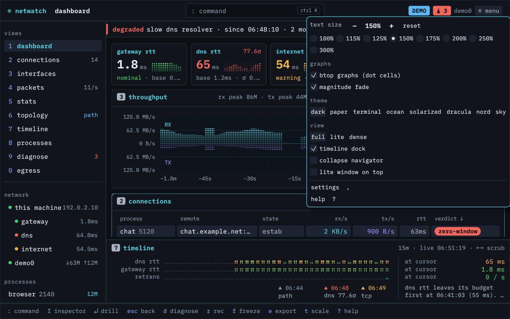

# netwatch desktop

See which programs on this computer use the network, and what's wrong with it. Everything runs on this machine, and it uploads nothing unless you look up an address's whois record or turn on online GeoIP lookups or AI insights.


netwatch desktop is the window version of [netwatch](https://github.com/matthart1983/netwatch), the terminal network monitor. It links the same `netwatch` library and runs the same collectors, diagnose engine and egress linter, so the two agree about what they see. In a window you also get a mouse, a command palette, text you can make larger, and room for more than 80 columns. You don't need the terminal tool installed. If you have it, both read the same `config.toml`, so a graph style set in one shows in the other. Each keeps its own theme.

It is not a remote dashboard. There is no server and no second engine. The app starts netwatch's runtime on a background thread and draws what that runtime sees on this machine.

0.2.0 is the first public release. Linux has binaries. macOS and Windows build from source and are experimental.

## Contents

- [Install](#install)
- [Text size](#text-size)
- [Building](#building)
- [Running](#running)
- [Permissions](#permissions)
- [What it sends over the network](#what-it-sends-over-the-network)
- [The window](#the-window)
- [Keys](#keys)
- [The ten tabs](#the-ten-tabs)
- [Views: full, lite, dense](#views-full-lite-dense)
- [Sheets](#sheets)
- [Themes and graphs](#themes-and-graphs)
- [Settings and saved state](#settings-and-saved-state)
- [Known limitations](#known-limitations)
- [How it is built](#how-it-is-built)
- [Development](#development)
- [Security, contributing and changes](#security-contributing-and-changes)
- [License](#license)

## Install

### Linux

Download a package from the [releases page](https://github.com/matthart1983/netwatch-desktop/releases). The x86_64 builds need glibc 2.35 or newer: Ubuntu 22.04, Debian 12, Fedora 36 or anything later. Each release lists its files' checksums in `SHA256SUMS`; check a download with `sha256sum -c --ignore-missing SHA256SUMS`, or its build provenance with `gh attestation verify <file> -R matthart1983/netwatch-desktop`.

On Debian or Ubuntu:

```sh
sudo apt install ./netwatch-desktop_*_amd64.deb
```

On Fedora and other RPM distributions:

```sh
sudo dnf install ./netwatch-desktop-*.x86_64.rpm
```

Both packages install `/usr/bin/netwatch-desktop`, add it to your desktop's app list, and grant it the one capability packet capture needs. [Permissions](#permissions) says which and why.

For anything else, the tarball holds the .deb's files under `bin/` and `share/`, and libpcap is built into the binary. Copy both into `/usr/local`, grant capture to the binary, and run it:

```sh
tar xzf netwatch-desktop-linux-x86_64.tar.gz
sudo cp -r netwatch-desktop-linux-x86_64/bin netwatch-desktop-linux-x86_64/share /usr/local/
sudo setcap cap_net_raw=ep /usr/local/bin/netwatch-desktop
netwatch-desktop
```

On first launch a sheet shows what works, what needs a grant and the exact command for it. Press `↵` to carry on.

### From source

With Rust and the libraries listed under [Building](#building):

```sh
cargo install --locked netwatch-desktop
```

### macOS and Windows

There are no binaries yet. Both build from source, as described under [Building](#building). They are experimental. CI builds and tests them, but nobody has tried them by hand.

## Text size

You can make everything in the window larger, from 100% to 300%. The default is 115%. The first-run sheet starts with a choice of Normal at 115%, Large at 150% and Larger at 200%. The sheet itself changes size as you pick, so you see the result before going on.

To change it later, use any of these:

- the `☰ menu` at the top right: `−`, `+`, `reset`, or a size from the list
- the command palette, opened with `ctrl K` or `:`. Type "text size", "zoom", "font" or "bigger"
- settings, opened with `,`, in the "this app" group
- `ctrl +` and `ctrl −`, `ctrl` with the scroll wheel, or a trackpad pinch. `ctrl 0` goes back to 115%. On macOS, use `⌘`
- in lite view, its own `☰ menu`

Every change applies at once in all three views, shows the new size briefly, and is saved for next time. To start large without saving it, for example from a launcher set up for someone else, use `netwatch-desktop --text-size 150`.

As the text grows, the inspector on the right moves into a sheet you open with `I`. Next the navigator keeps only the tab names, and last it becomes a column of digits. Panels scroll rather than shrink or disappear. On a 1366×768 laptop the tab names stay written out up to 200%.



## Building

The netwatch library comes from crates.io as `netwatch-tui`, pinned to an exact version (0.35.1). You don't need a netwatch checkout.

```sh
git clone https://github.com/matthart1983/netwatch-desktop
cd netwatch-desktop
cargo build --release --locked
```

You need Rust 1.95 or newer. Debian and Ubuntu package an older one, so install it with [rustup](https://rustup.rs). You also need the same system libraries netwatch needs, plus what eframe needs to open a window.

On Fedora:

```sh
sudo dnf install libpcap-devel libxkbcommon-devel wayland-devel mesa-libGL-devel
```

On Debian or Ubuntu:

```sh
sudo apt install libpcap-dev libxkbcommon-dev libwayland-dev libgl1-mesa-dev
```

On macOS, the Xcode command line tools should be enough. On Windows, install the [Npcap SDK](https://npcap.com) and set `LIB` to its `Lib\x64` directory to build, and Npcap itself to capture.

This build turns off netwatch's eBPF attribution (`default-features = false`), so there is no kernel-capability dependency beyond packet capture.

To build against a local netwatch checkout instead, override the dependency for one command rather than editing `Cargo.toml`:

```sh
cargo build --config 'patch.crates-io.netwatch-tui.path="../netwatch"'
```

The checkout's version has to match the pin, or cargo warns that the patch was not used and builds the crates.io release. The override also rewrites `Cargo.lock`, so leave that change out of commits (`git checkout Cargo.lock`).

## Running

```sh
./target/release/netwatch-desktop
```

Useful flags:

| flag | what it does |
|---|---|
| `--demo` | Adds netwatch's diagnose demo scenario and a seeded packet capture on top of this machine's live data. Good for seeing every screen populated, but your own sockets, addresses and processes are still there. |
| `--tab <name>` | Opens on a tab: `dashboard`, `connections`, `interfaces`, `packets`, `stats`, `topology`, `timeline`, `processes`, `diagnose`, `egress`. |
| `--view full\|lite\|dense` | Starts in a view. `--lite` is short for `--view lite`. |
| `--no-sandbox` / `--sandbox-strict` | Overrides config.toml's `sandbox` for this launch, as in the TUI. |
| `--text-size <percent>` | Text size for this launch only, 100 to 300 (for example `--text-size 150`). The saved size is unchanged unless you change it in the app. |
| `--dense-box 1-4` | In dense view, opens with one box zoomed. `--zoom` still works but is deprecated. |
| `--sheet <name>` | Opens a sheet: `settings`, `recorder`, `firstrun`, `palette`, `help`. |
| `--theme <name>` | Starts with a palette (see [themes](#themes-and-graphs)). |
| `--window-size WxH` | Sets the initial window size in logical pixels. |
| `--app-chrome` | Draws the app's own title bar and window controls instead of the system's. |
| `--ephemeral` | Neither reads nor writes the saved layout (`desktop.toml`), and skips the first-run sheet. |
| `--graph-preview` | Runs on a synthetic snapshot with no collectors and no probes. Used for graph and layout checks. |
| `--check-runtime` | Starts the runtime headless, prints interface, capture, diagnose coverage, socket and PID counts and the capability report, then exits. |
| `--screenshot <path>` | Saves a PNG of the window after about three seconds and exits. Runs with this flag neither read nor write saved layout. |
| `--help` / `--version` | Usage or version. Unknown flags and bad values are rejected. |

If the runtime fails to start (for example `sandbox = "strict"` where the platform can't enforce it), the window says why and offers `r` to retry with the sandbox off for that launch, or `S` to set `sandbox = "on"` and retry.

`--check-runtime` is the quickest way to find out what the app can see on a machine:

```
interface: wlan0
counters only · Capture failed: libpcap error: ... CAP_NET_RAW may be required
no visible findings · 12/25 rule inputs available · 0 learning · 13 unavailable
107 connections · 78 with a pid · 61 kernel TCP records
```

## Permissions

The app never asks for root and never raises its own privileges. Don't run it with `sudo`. It doesn't need it, and the layout and exports it writes in your home would end up owned by root. It doesn't warn about this yet.

Without packet capture the app still works. You get interface counters, the socket table with process attribution for processes your user can inspect, kernel TCP metrics, and the probes described below. Per-flow rates, the packet list, TLS and DNS decode, and handshake timing need capture.

On Linux, capture needs one capability, `cap_net_raw`. The .deb and .rpm grant it when they install. For the tarball or your own build, grant it to the binary:

```sh
sudo setcap cap_net_raw=ep ./target/release/netwatch-desktop
```

The grant belongs to that file, so a rebuild or a copy loses it and you grant it again. A running app doesn't pick up a new grant, so quit and start it again. This build has no eBPF backend. `cap_bpf` and `cap_perfmon` would add nothing, and the app doesn't ask for them.

The first-run sheet shows what is ready, what needs a grant, and the exact command for the running executable. It opens on first launch and again if a capability that was ready goes missing. Press `↵` to continue without capture.

Sockets owned by other users' processes, such as root daemons, stay unattributed.

On macOS, which is experimental, capture reads `/dev/bpf*`. Only root can open it by default, and Wireshark's ChmodBPF is the usual way to give your user access. On Windows, also experimental, install [Npcap](https://npcap.com).

### Sandbox

On Linux, netwatch confines its runtime thread and the workers it starts with Landlock. They read only what they need and write only to netwatch's own directories. Network access isn't restricted. The window's own thread isn't confined, because it has to open the display and graphics, and neither is the worker that loads and exports diagnose incident history. A small thread that starts before confinement reads socket ownership from the kernel's `/proc` tables, so attribution works with the sandbox on. `--no-sandbox` and `--sandbox-strict` override `config.toml`'s `sandbox` setting for one launch.

## What it sends over the network

Collection and analysis stay on this machine, but the health checks are real traffic. With the default settings the app sends:

- a ping to your gateway every few seconds, or a TCP connection where ping is blocked
- a DNS query for the root zone to your resolver every few seconds. In the same cycle it asks your resolver and Cloudflare's 1.1.1.1 for `dns.google` and compares the answers, which catches captive portals and DNS interception
- a ping to 1.1.1.1 every few seconds, or a TCP connection to its port 443 where ping is blocked
- a STUN request to `stun.l.google.com` and `stun.cloudflare.com` about once a minute, to see how your NAT behaves
- one traceroute to 1.1.1.1 each time the app starts, so topology has a path. You can't turn it off yet
- reverse DNS lookups through your resolver for the addresses your machine talks to

These only happen when you ask for them:

- whois lookups with `W`, which send the selected public address to rdap.org over HTTPS
- traceroutes with `T`, and the diagnose tests you run. Each test says what traffic it sends before you run it
- probes of the services you list under `[[diagnose_targets]]` in `config.toml`, described in [docs/DIAGNOSE.md](docs/DIAGNOSE.md)
- online GeoIP lookups, which send remote addresses to ip-api.com. `geoip_online` is off by default
- AI insights, which send a network summary to the endpoint you configure. `insights_enabled` is off by default

Each setting that sends something says so beside it in the settings sheet.

## The window


Every tab shares one frame:

- The title bar has the breadcrumb (for example `connections › browser:443`), a command field that opens the palette, chips for recorder state, pause, open issues, blocked egress destinations and egress drift, the capture interface, and the menu.
- The navigator on the left lists the ten tabs with live badges (socket count, packet rate, open issue count, blocked or drifting destinations). Under it is a network tree (this machine, gateway, dns, internet, interfaces) and the top processes. Clicking a node filters the current tab and adds it to the breadcrumb. `esc` removes it.
- A status strip appears when an issue is open. It reads from the same issue list as the diagnose tab and disappears when things are healthy.
- The inspector on the right follows the selection on tabs that have one (dashboard, connections, packets, processes, egress).
- The timeline dock sits under the dashboard, connections and diagnose.
- The footer lists the keys the current tab responds to. Every hint is clickable and does the same thing as the key. Results of writes (exports, policy changes, config saves) show at the right with their path.

As the window narrows or the text grows, the inspector goes first. Below 1180 points wide it moves into a sheet opened with `I`. Below 860 the navigator drops the network tree and process list and keeps a narrow list of tab names. Below 620 it becomes a rail of digits, and hovering a digit shows the tab's name. The tab list scrolls when the window is too short for all ten. Points are window pixels divided by the text size. At the default 115% the inspector goes below about 1357 pixels, and tab names stay up to 200% on a 1366-pixel screen and up to 300% on a 1920-pixel one. The menu and palette can collapse the navigator to the rail, which keeps the inspector down to 1020 points, and can hide the timeline dock. The dock gives up height in short windows.

## Keys

Global keys work on every tab unless a sheet is open.

| key | action |
|---|---|
| `1`-`9`, `0` | switch tab |
| `:` or `ctrl-k` | command palette |
| `↵` / `esc` | drill into the selection / back one breadcrumb level |
| `↑` `↓` | move the selection |
| `tab` | move focus between panels |
| `p` | pause or resume the display (collectors and recording keep running). `space` is for panel actions such as folding |
| `d` | diagnose |
| `ctrl-c` | copy the selected row |
| `I` | inspector sheet, when the window is too narrow for the column |
| right-click | a row's actions, the same as its inspector |
| `R` | arm or disarm the flight recorder |
| `F` | freeze the recorder |
| `E` | open the recorder and export sheet |
| `V` | cycle full, lite, dense |
| `L` | lite view |
| `t` | graph scale or window on graph tabs |
| `,` | settings |
| `?` | every key for the current tab, or for dense and lite in those views |
| `q` | quit |
| `ctrl +` / `ctrl -` / `ctrl 0` | larger or smaller text, or back to 115% (shared across all views). `ctrl` + scroll and trackpad pinch also work. See [Text size](#text-size) |

## The ten tabs

Each tab lists its own keys in the footer and in `?`.

**1 dashboard.** Five stat cards (gateway, dns and internet rtt, probe loss, retransmits) with sparklines and baselines, the throughput graph, health rows with the engine's findings, the top connections by concern, and the timeline dock. `↵` opens the selected socket in connections, `e` exports the diagnose report, `t` switches linear or log scale.

**2 connections.** Every socket with process and PID, remote host (resolved when known), application protocol, state, rates, kernel rtt, retransmits, age, verdict and a 60 second rtt history. Control strip for show (concern, all, established, listen, time-wait) and group (none, host, process). Listeners and system daemons with no egress fold into one line (`z`). With grouping on, `space` folds the group under the cursor, `←` `→` fold and unfold, `Z` folds all, and `↑` `↓` also stop on group headers. `/` filters, `s` sorts, `g` groups, `↵` opens packets for the socket, `p` its process, `W` whois, `T` traceroute, `e` exports JSON and CSV.

**3 interfaces.** A table sized to the interface count with role, link speed, rates, a saturation meter, errors, drops and history. The detail panel has addresses, MTU, session counters and a one-line finding. `i` moves capture to the selected interface.


**4 packets.** The capture strip (live or stopped, ring size, shown, drops, packets per second, BPF filter) and a virtualized list with an expert gutter. The title-bar field becomes the display filter with a live match count, using netwatch's filter grammar (`tcp`, `dns`, `10.0.0.1`, `port 443`, `stream 7`, `sni:github`, `decrypted:true`, `and`, `or`, `not`). Under the list is a layered decode (frame, ethernet, ip, tcp or udp, tls or quic, l7) beside hex that highlights the selected layer's bytes. The inspector summarises the stream: 5-tuple, TLS version and ALPN, bytes each way, retransmits, handshake timing. The inspector adds the peer's reverse DNS, geo and (after `W`) whois, and names the JA4 client. Keys: `c` capture, `b` BPF, `f` follow (wheel scrolling turns it off), `/` filter and `esc` to clear it, `↵` filters to the stream and then opens its connection, `m` bookmark, `[` / `]` previous or next bookmark, `M` bookmarks only, `n` / `N` next finding, `x` findings only, `h` hex or text, `w` pcap of the list, `S` pcap of the stream, `j` pivot on JA4, `W` whois, `y` copy the packet, `i` interface. Right-click a row for the same actions. Bookmarks last for the session.

**5 stats.** Counters for packets, bytes, flows and protocol shares; a protocol breakdown with l7 nested under l4; top processes and remotes; session throughput; and an rtt distribution on a log axis with p50, p90 and p99. `[` `]` window, `u` bytes or frames.


**6 topology.** This machine, gateway, DNS servers and on-link peers; each target's path drawn as chained hop boxes (changed hops highlighted, silent hops dashed); and a hop table with loss, last, p50, p95, jitter and distribution. A hop that doesn't answer while later hops do reads as a silent hop, not loss. `T` traces the target or selected hop, `W` whois, `↵` connections for that host.

**7 timeline.** DNS, gateway and internet rtt, retransmits and throughput on one time axis with a shared cursor, event markers, an events table, and every track's value at the cursor with a plain statement of what moved first. `←` `→` scrub, `t` window (1m to 1h), `k` kinds, `esc` back to live.

**8 processes.** Per-process connections, rates, rtt p50, retransmits and worst verdict. The inspector reads command line, cgroup, user, threads and file descriptors from `/proc`, lists destinations with their egress verdicts, and plots tx against rtt.


**9 diagnose.** An engine strip (inputs available, baselines ready or learning, rules live) so an empty issue list can be read correctly. Issues in severity order, the chronology, and a detail pane in report order: evidence, ranked probable causes with each check written out, remediation steps, and the condition that closes the issue. `↵` applies a fix where netwatch can (simulated in demo mode, never applied by a live desktop session), `a` acknowledges, `m` mutes for an hour, `o` writes `report.md`, `y` copies.

The target strip expands to show configured services and their DNS, TCP, TLS and HTTP probe results. In **Tests and recovery**, each offered test describes its traffic and estimated cost before you run it; running tests and the latest results appear alongside it. **I've done this** records a manual remediation step and lets the engine check recovery, including re-running supporting tests after a minute. **What caused this issue?** saves your answer with the recorded incident when episode recording is enabled. Saved incident history, cause labels and the pseudonymised export are described in [docs/DIAGNOSE.md](docs/DIAGNOSE.md).

**0 egress.** Learned destinations per process as a foldable tree with match type (SNI, IP, ASN, ECH), bytes, first and last seen, activity and policy verdict. The inspector shows what was seen and which rule line would admit it. `a` reviews allowing one destination, `d` keeps warning for the re-warn interval, `↵` on a destination opens packets, and `↵` on a process or `w` reviews its promotion. `P` reviews all observed processes together; `x` reviews removing the selected process rule. Every policy change shows the complete file diff before `y` or **Write policy** confirms it; `esc` cancels. Allowing an unruled process explains how many other observed destinations will become drift. A destination on the policy's block list, global `[block]` or `[process.<name>.block]`, reads `blocked` in red, comes first in the status strip and the tab badge, and has no allow action, because a block entry wins over any allow line. Promotion leaves blocked destinations out of the rule, and its review names them. The navigator lists the global block list and the alert mode: blocked destinations only by default, every finding with `alert = "all"`. Demo mode disables policy writes. Invalid or group/world-writable policy files are refused; the backend also rejects a file changed since preview. Writes preserve existing permission bits, comments, unrestricted ports, the global block list and the alert mode. Allowing and promoting also keep a rule's own block list. Removing a rule removes its block list with it, and the review names the entries that go.

## Views: full, lite, dense

All three views run on the same backend. Switching views never restarts collectors, and the selected socket, pause state and graph settings carry across.


**Dense** packs four boxes: mirrored throughput with session totals, interfaces, health with rtt budget meters, and connections with the selected socket's kernel state above the table. `1`-`4` zoom a box. Dense uses the same text sizes and interface zoom as full and lite. In the connections box `g` cycles grouping, `space` and `Z` fold groups. `ctrl +` / `ctrl -` adjusts the shared text size; switching views keeps text the same size. See [docs/DENSE.md](docs/DENSE.md).


**Lite** is a small window (minimum 720 by 420) with throughput, reachability and top talkers. It remembers its size and can stay on top ("lite window on top" in the menu or palette).

## Sheets

Sheets open over the current screen, which keeps updating underneath. `esc` closes any of them.


- **Command palette** (`:`). Fuzzy search over commands, tab jumps, packet display filters and entities (hosts and processes). Every row shows the key that does the same thing. `/` narrows to filters, `>` to jumps, `@` to hosts and processes. `tab` completes, `↵` runs. Recent commands come first.
- **Settings** (`,`). "this app" first (text size), then the netwatch `config.toml` grouped as appearance, refresh and capture, GeoIP, alerts, AI insights and security. `←` `→` cycle values, `↵` edits text, `S` saves. Invalid values are marked on the row. Below the settings is the live capability report.
- **Flight recorder** (`E`). Armed, frozen and exported states with who froze it, packet density over the five-minute ring, the files that go into the bundle, and where they land. `R` arms, `F` freezes, `E` exports.
- **First run.** Text size, what works now, what needs a grant, and the command for this platform.
- **Help** (`?`). Global keys and the current tab's keys.

## Themes and graphs

Themes: `dark` and `paper` from the design spec, plus the six netwatch TUI themes `terminal`, `ocean`, `solarized`, `dracula`, `nord` and `sky`, mapped slot for slot. Pick one from the menu or the palette ("cycle theme"). The settings sheet's theme, view and default-tab rows configure the terminal app.

Charts have two looks. The default is btop-style dot cells lit from the baseline. The other is solid bars. Either can use a magnitude fade that runs from dim at the baseline to the full series colour at the top. The switch applies to every chart in the app: throughput plots, sparklines, timeline tracks, histograms and share bars. Toggle it from the menu at the top right, the palette (`graphs: switch to bars`), or settings. It is saved as `graph_style` (`dots` or `bars`) and `graph_fade` in the netwatch config, so the TUI follows the same setting.

The UI uses IBM Plex Mono throughout and IBM Plex Sans for first-run prose, with Adwaita Mono as a fallback for symbols Plex lacks. All three are bundled.

## Settings and saved state

Two files:

- `~/.config/netwatch/config.toml` is netwatch's own config, shared with the TUI: theme, graph style, refresh rate, capture interface, BPF filter, GeoIP, alerts, AI insights, sandbox mode and so on. Edit it with the settings sheet. Saving writes only the settings you changed. Comments, sections this build doesn't know (a newer TUI's) and changes the TUI made meanwhile stay as they are. If netwatch can't read the file, the save is refused and the file is left alone.
- `~/.config/netwatch/desktop.toml` holds the desktop's layout: the last tab and view, theme, text size (`zoom`), dense grouping, dock height, the lite window size, per-tab choices (sort, grouping, filters) and recent palette commands. Set `NETWATCH_DESKTOP_PREFS` to use another path. It's written atomically, and only your user can read it (0600). A value that doesn't fit, such as an unknown tab, falls back on its own; a file that isn't valid TOML is copied to `desktop.toml.bak` and the layout starts from defaults.

Exports go to `~/.cache/netwatch/exports/`, which only your user can open: the directory is 0700 and every export in it 0600, since they hold addresses, hostnames, process names and packet bytes. With no home directory there is nowhere to export, and exports say so rather than write to `/tmp`. The egress policy lives at `~/.config/netwatch/egress-policy.toml`.

## Known limitations

- Screen readers can read the navigator's tab list and little else. Most of the window is drawn text without accessibility labels.
- In `dark` and `paper`, text and muted text pass 4.5:1 contrast, but the selected row's background is faint and a few status colours fall just short. The six terminal themes have lower contrast, and there is no high-contrast theme yet. Some status marks, such as the navigator's health dots and lite's rows, use colour alone.
- A capture grant takes effect on the next start, and the app doesn't say so yet.
- The app doesn't refuse or warn when it runs as root.
- The [sandbox](#sandbox) covers netwatch's runtime and workers, not the window's thread or the incident history worker.
- `--demo` adds a scenario on top of live data. Your machine's addresses, processes and PIDs stay on screen, so its screenshots aren't synthetic.
- The traceroute to 1.1.1.1 at startup always runs.
- macOS and Windows are experimental, with no binaries, and nobody has tried them by hand.
- netwatch doesn't collect ASN per traceroute hop, interface driver, qdisc or offloads, per-interface gateway and DNS, TLS version per packet, or `tcp_info` pacing, delivered and lost. The screens show `–` for these and say so.
- Traceroute runs one target at a time and keeps no history. A changed hop only shows after a retrace in the same session.
- Timeline retransmission and recorder history start when the app starts.
- Table columns can't be reordered or resized.
- App-drawn window chrome is opt-in until edge resizing is checked on more compositors.

## How it is built

The app uses egui and eframe for the UI. It depends on netwatch as a library.

```
netwatch-desktop
├── backend.rs      runtime thread: App, tick, Snapshot, Command → ActionResult
├── shell.rs        the Screen and Sheet traits, keys, hints, breadcrumb, filters
├── app.rs          the frame: title bar, navigator, strip, inspector, dock, footer, key routing
├── ui_kit.rs       panels, control strips, tables, pills, key hints, meters, bars
├── theme.rs        runtime palettes, graph look, fonts
├── graphs.rs       cached-texture throughput and latency graphs
├── zoom.rs         text size presets, steps and limits
├── screens/        one module per tab
├── sheets/         settings, first run, recorder, palette, help
├── dense.rs        dense view
└── lite.rs         lite view
```

The runtime thread owns netwatch's `App`. Once per tick it copies what the screens read into an immutable `Snapshot`. Large append-only stores, the packet ring and stream tracker, cross as shared handles so 5,000 packets are not cloned every second. Screens never touch `App`. They queue a `Command` (export, capture, BPF, whois, traceroute, egress promote, diagnose apply, config save), and each command returns one result that the footer shows.

A screen implements `Screen`: `draw`, `hints` and `key`, plus optional `inspector`, `navigator`, `status`, `command_field`, `palette`, `save` and `restore`. Keys go to an open sheet first, then global digits and `:`, then the screen, then the shell's global keys. Footer clicks go through the same path.

The large graphs pre-render their capacity grid and lit gradient as GPU textures once per size, DPI, palette and graph look. A frame only moves the measurement mask. See [docs/GRAPHS.md](docs/GRAPHS.md). Smaller charts batch their bars into one mesh per chart.

Where netwatch doesn't collect something a design calls for, the slot stays and the panel says why. No values are made up.

## Development

```sh
cargo fmt --all
cargo clippy --all-targets -- -D warnings
cargo test
```

`cargo test` includes the render matrix, which draws every tab, sheet and view at every text size on several screen sizes, headless, and fails on a panic or on content that leaves the window. [CONTRIBUTING.md](CONTRIBUTING.md) has the rest.

The screenshots in `docs/screenshots/` are drawn headless by the test suite from a synthetic snapshot (`src/app/screenshots/fixture.rs`): documentation addresses, made-up processes and PIDs, and netwatch's demo incident. After a visible change, redraw them:

```sh
cargo test write_screenshots -- --ignored
```

A normal `cargo test` draws the same frames and fails if any of them shows an address outside the documentation ranges or this machine's host name, user name, interface names or addresses.

For a quick look at the real window, `--screenshot` saves one PNG and exits. Use it with `--graph-preview`, which draws a synthetic snapshot. `--demo` adds the demo scenario on top of this machine's live data, so its screenshots show your addresses, processes and PIDs:

```sh
./target/debug/netwatch-desktop --graph-preview --tab dashboard --window-size 1440x900 --screenshot /tmp/dashboard.png
./target/debug/netwatch-desktop --graph-preview --view dense --screenshot /tmp/dense.png
```

Opt-in performance checks:

```sh
cargo test dense::tests::dense_frame_cost_and_capacity_cache -- --ignored --nocapture
cargo test cached_graph_frame_cost -- --ignored --nocapture
```

Design decisions and the reasoning behind them are in [docs/DESIGN-NOTES.md](docs/DESIGN-NOTES.md).

## Security, contributing and changes

- Found a security problem? Please don't open an issue; see [SECURITY.md](SECURITY.md).
- [CONTRIBUTING.md](CONTRIBUTING.md) covers building, tests, screenshots and pull requests.
- [CHANGELOG.md](CHANGELOG.md) lists what changed in each release.

## License

MIT. IBM Plex and Adwaita Mono are under the SIL Open Font License; their licence files are in `assets/fonts/`.
